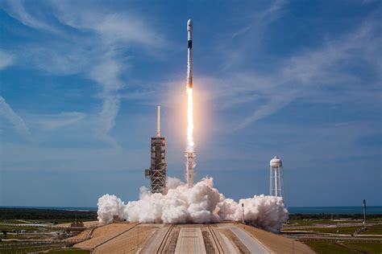

# Raketligningen 

Her kan du finde forskellige simuleringer, som viser, hvordan raketbevægelser ændrer sig, når man medtager flere fysiske faktorer. Hver kode viser et konkret eksperiment med en raket i GlowScript, så du kan sammenligne idealiserede tilfælde med mere realistiske modeller.

## Bevægelse uden tyngdefelt
Denne simulation viser rakettens bevægelse, når der kun er kraft fra motoren og ingen tyngdekraft. Det er en forenklet model, der er god til at forstå den grundlæggende raketbevægelse, før man tilføjer flere kræfter.

**kode:**
[https://glowscript.org/#/user/mps/folder/raketter/program/r1](https://glowscript.org/#/user/mps/folder/raketter/program/r1)

## Med tyngdekraft
I denne simulation tilføjes Jordens tyngdekraft. Du kan se, hvordan rakettens hastighed og bane ændres, når der er et konstant tyngdefelt.

**kode:**
[https://glowscript.org/#/user/mps/folder/raketter/program/r2](https://glowscript.org/#/user/mps/folder/raketter/program/r2)

### Raketopsendelse hvor motoren slukkes
Her slukkes motoren efter en periode, og raketten fortsætter som et frit fald med tyngdekraften. Det viser, hvordan raketens bevægelse ændres, når fremdriften stopper.

**kode:** 
[https://glowscript.org/#/user/mps/folder/raketter/program/r3](https://glowscript.org/#/user/mps/folder/raketter/program/r3)

## Med luftmodstand
Disse simulationer tager luftmodstand med i modellen. Luftmodstand påvirker rakettens hastighed og kan ændre både acceleration og maksimal højde.

### Konstant atmosfære
Denne version bruger en atmosfære med konstant tæthed. Det er en god første tilgang til at se, hvordan luftmodstand bremses raketten i en enkel model.

**kode:**
[https://glowscript.org/#/user/mps/folder/raketter/program/r4](https://glowscript.org/#/user/mps/folder/raketter/program/r4)

### Aftagende atmosfære
Her bruges en model, hvor atmosfærens tæthed aftager med højde. Det er mere realistisk for raketopsendelser, fordi luften bliver tyndere, jo højere raketten kommer.

**kode:**
[https://glowscript.org/#/user/mps/folder/raketter/program/r5](https://glowscript.org/#/user/mps/folder/raketter/program/r5)
